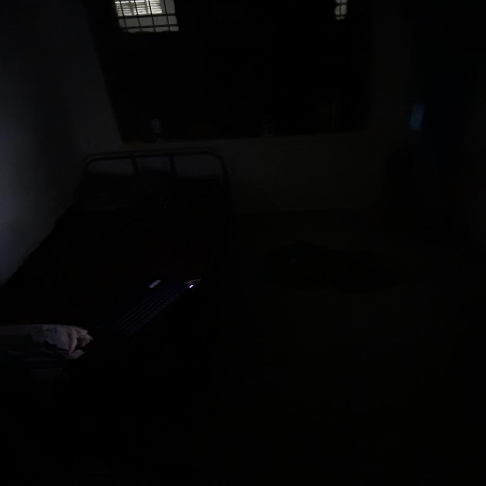

# Attention-Guided Hybrid Retinex for Low-Light Image Enhancement

A hybrid attention-guided Retinex model with multi-scale refinement using ConvBlock architecture, guided fusion, and spatial attention mechanisms for improving low-light images. This model is trained on LOL – Low-Light dataset 


## Installation

```
pip install -r requirements.txt
```

## Dataset Structure

```
LOL-v1/
├── train/
│   ├── low/     # Low-light images
│   └── high/    # Ground truth
└── test/
    ├── low/
    └── high/
```

## Usage

### Training
```
# Basic training
python main.py --mode train --data_dir ./dataset

# Training with specific parameters  
python main.py --mode train --data_dir ./dataset --epochs 100 --batch_size 4 --lr 1e-4 --patch_size 192
```

### Evaluation
```
# Evaluate model
python main.py --mode eval --data_dir ./dataset/test --checkpoint checkpoints/best_model.pth --save_dir results_eval

# Evaluation with intermediates
python main.py --mode eval --data_dir ./dataset/test --checkpoint checkpoints/best_model.pth --save_intermediates
```

### Inference
```
# Single image enhancement
python main.py --mode inference --input_image input.jpg --checkpoint checkpoints/best_model.pth --output_path enhanced.jpg

# With intermediate outputs
python main.py --mode inference --input_image input.jpg --checkpoint checkpoints/best_model.pth --save_intermediates
```

## Architecture

Our hybrid model follows a **four-stage enhancement pipeline** that seamlessly integrates classical Retinex theory with modern attention mechanisms:

**DecompositionNet** → Applies Retinex decomposition to separate input images into reflectance (R) and illumination (I) components using ConvBlock layers with BatchNorm for stable feature extraction.

**RelightNet** → Enhances the illumination map through spatial attention mechanisms, utilizing adaptive pooling and channel-wise gating followed by bilinear upsampling for brightness restoration.

**GuidedFusion** → Intelligently combines the original reflectance with enhanced illumination using learned attention weights, preserving color information while improving brightness.

**RefinerNet** → Performs final multi-scale refinement through parallel processing branches (3×3, 5×5, 7×7 kernels) that capture both fine details and global context for natural image output.

The pipeline processes images as: **Input → [R, I] → I_enhanced → Fusion → Final Enhanced Image**, with each stage optimized for specific enhancement tasks while maintaining computational efficiency.


## Command Arguments

**Training:** `--data_dir` (required), `--epochs` (100), `--batch_size` (4), `--lr` (1e-4), `--patch_size` (192)

**Evaluation:** `--data_dir`, `--checkpoint` (required), `--save_dir` ("results_eval"), `--save_intermediates`

**Inference:** `--input_image`, `--checkpoint` (required), `--output_path` ("results/enhanced.jpg"), `--save_intermediates`

## Results

Examples of low-light enhancement using our Attention-Guided Hybrid Retinex model (last two are extremely low-light cases unseen during training):

| Low-Light | Enhanced |
|-----------|----------|
|  |  |
|  |  |
|  |  |

## Note

### Current Limitations:
- **Text Regions**: May occasionally blur fine text details in extremely low-light scenarios
- **Color Saturation**: Some color oversaturation in highly enhanced regions  
- **Edge Artifacts**: Minor artifacts around high-contrast edges in complex scenes

### Planned Improvements:
- **Text-Aware Loss**: Incorporating OCR-based text region preservation
- **Color Constancy**: Enhanced LAB color space optimization with perceptual constraints
- **Edge Refinement**: Advanced gradient-aware smoothing in RefinerNet
- **Adaptive Attention**: Dynamic attention weighting based on content complexity

**Contributions and suggestions for improving this pipeline are welcome!**

  
## Author

**Tejas Thakare**  
GitHub: [TejasCThakare](https://github.com/TejasCThakare)  
LinkedIn: [tejas-t-722758204](https://www.linkedin.com/in/tejas-t-722758204)
```
