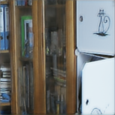

# Attention-Guided Hybrid Retinex for Low-Light Image Enhancement

A hybrid attention-guided Retinex model for low-light image enhancement featuring spatial attention mechanisms, guided fusion, and multi-scale refinement with ConvBlock architecture. Utilizes streamlined 8-component loss optimization to effectively restore brightness, enhance contrast, and preserve color fidelity while maintaining computational efficiency.


## Installation

```
pip install -r requirements.txt
```

## Dataset Structure

```
dataset/
├── train/
│   ├── low/     # Low-light images
│   └── high/    # Ground truth
└── test/
    ├── low/
    └── high/
```

## Usage

### Training
```
# Basic training
python main.py --mode train --data_dir ./dataset

# Training with specific parameters  
python main.py --mode train --data_dir ./dataset --epochs 100 --batch_size 4 --lr 1e-4 --patch_size 192
```

### Evaluation
```
# Evaluate model
python main.py --mode eval --data_dir ./dataset/test --checkpoint checkpoints/best_model.pth --save_dir results_eval

# Evaluation with intermediates
python main.py --mode eval --data_dir ./dataset/test --checkpoint checkpoints/best_model.pth --save_intermediates
```

### Inference
```
# Single image enhancement
python main.py --mode inference --input_image input.jpg --checkpoint checkpoints/best_model.pth --output_path enhanced.jpg

# With intermediate outputs
python main.py --mode inference --input_image input.jpg --checkpoint checkpoints/best_model.pth --save_intermediates
```

## Architecture

- **DecompositionNet**: Separates reflectance (R) and illumination (I) using ConvBlock layers with BatchNorm
- **RelightNet**: Enhances illumination using spatial attention and upsampling with bilinear interpolation
- **GuidedFusion**: Combines R and I_enh using guided attention mechanism
- **RefinerNet**: Multi-scale refinement with 3-branch kernels (3x3, 5x5, 7x7) and fusion

## Command Arguments

**Training:** `--data_dir` (required), `--epochs` (100), `--batch_size` (4), `--lr` (1e-4), `--patch_size` (192)

**Evaluation:** `--data_dir`, `--checkpoint` (required), `--save_dir` ("results_eval"), `--save_intermediates`

**Inference:** `--input_image`, `--checkpoint` (required), `--output_path` ("results/enhanced.jpg"), `--save_intermediates`

## Results

Examples of low-light enhancement using our Attention-Guided Hybrid Retinex model (last two are extremely low-light cases unseen during training):

| Low-Light | Enhanced |
|-----------|----------|
|  |  |
|  |  |
|  |  |


## Author

**Tejas Thakare**  
GitHub: [TejasCThakare](https://github.com/TejasCThakare)  
LinkedIn: [tejas-t-722758204](https://www.linkedin.com/in/tejas-t-722758204)
```
